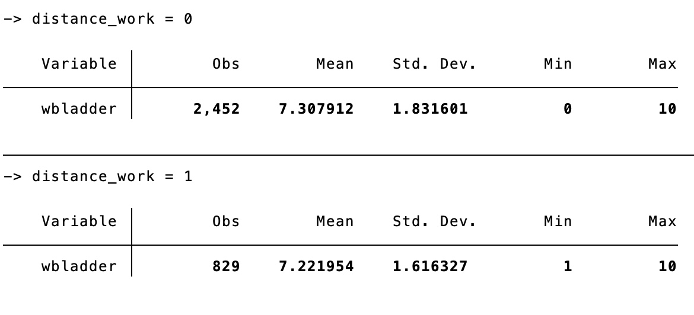
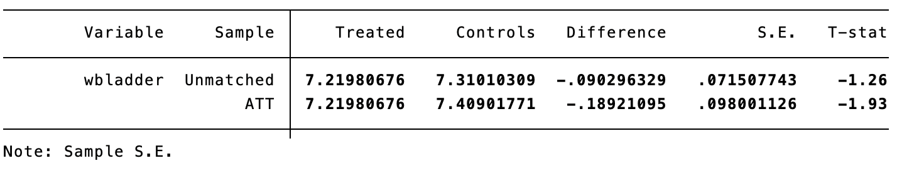

```{r setup, include=FALSE}
knitr::opts_chunk$set(echo = FALSE)
```
## Research Topic

-   During the COVID-19 pandemic, there are a lot of workers were asked to work form home because of lock-down.

-   The question I want to examine is:

    During the pandemic, is the **well-being index** of home workers lower?

## Data & Sample

### Data

IPUMS Time Use data 2021

### Sample
-   \# of obs: 3281
-   I collected a cross-sectional individual-level survey data.

-   I dropped all the observations do not answer whether they are working from home or not, as well as excluded those observations with no job and no income.

## Empirical Specification

-   Propensity score:

    $$
    p(X_i) = E(D_i|X_i) = Pr(D_i = 1|X_i)
    $$

-   Assume CIA holds:

    $$
    (Y^1_i, Y^0_i) \space \bot \space D_i|p(X_i)
    $$

    -   Where $Y^d_i$ represents the potential outcome when $D_i = d$

-   Estimate the propensity score using logit regression:

    $$
    \hat p(X) = \hat Pr(D_i=1|X_i) = \frac{1}{1+e^{-(\hat\beta_0+\hat\beta_1 x_1 + ...+ \hat\beta_k x_k)}}
    $$

## Variables

-   $Y_i$ represents an outcome of interest:

    -   `Well-being index`: 0\~10, 0 for the worst life, 10 for the best life

-   $D_i$ represents a binary treatment of interest:

    -   `Distance working or not` : 1 for distance worker, 0 for commuter

-   $X_i$ represents the a set of control variables:

    -   `Occupation`, `marrital status`,`age`, `race`, `sex`, `have child or not`, `full-time or part-time`, `earning per week`, `State`
    
## Summary statistics
``` stata
sort distance_work
by distance_work : sum wbladder
```
```{r}

```

## PSCORE Matching Results
``` stata
global X i.statefip age female hh_child i.occ2 ///
         earnweek i.race i.fullpart
global D distance_work
global Y wbladder
psmatch2 $D $X, out($Y) n(3) ai(3)
```
```{r}

```


## Future Work

### Subgroup analysis
-   Male vs. Female
-   Have child vs. No child
-   Married vs. Single
